# Multi-Agent Reinforcement Learning for Railway Traffic Management 🚂

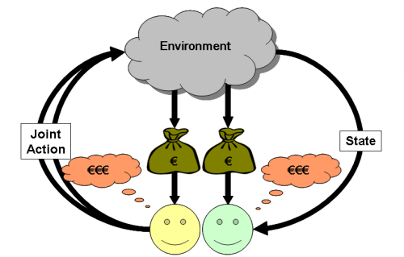

This repository contains my Dual Degree Project (DDP) work at IIT Madras, where I investigated multi-agent path-finding and reinforcement learning approaches for railway traffic management using the Flatland simulation environment.

## Project Overview

During this project, I conducted a comprehensive study of both **Operations Research (OR)** and **Deep Reinforcement Learning (RL)** methods for solving the multi-agent railway scheduling problem. The work encompasses:

- **Classical OR Approaches**: Implementation and analysis of SIPP, CBS, and LNS-based MAPF algorithms
- **Deep RL Methods**: Comparative study of D3QN, Multi-Agent PPO, and custom observation representations
- **Novel Architecture**: Development of a TreeLSTM-based policy network with self-attention mechanisms that achieves 85-95% completion rates even with 30+ agents in dense networks
- **Real-World Validation**: Integration of Indian Railways geospatial data (Tamil Nadu stations) to test approaches on realistic network topologies

The key innovation is using Tree-structured LSTMs to process hierarchical observation structures while preserving spatial relationships, combined with multi-head self-attention for implicit agent communication.

---

## The Flatland Environment

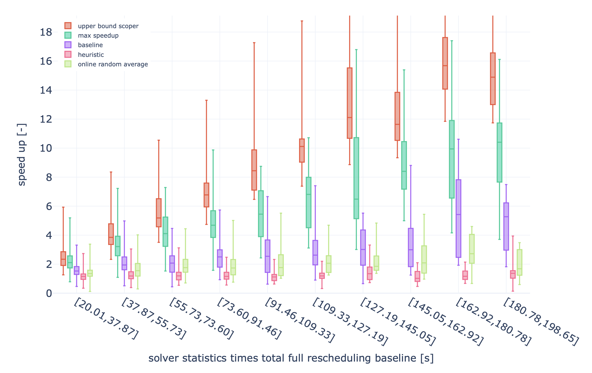

Flatland is a 2D grid-based railway simulation environment developed for the NeurIPS 2020 competition. It provides a realistic testbed for multi-agent reinforcement learning algorithms by simulating complex railway network dynamics.

**Example Environment with Multiple Trains:**
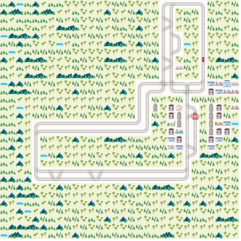
*Typical Flatland scenario showing trains at different stations with color-coded paths to their destinations*

### Environment Characteristics

The environment models railway operations with the following properties:

- **Discrete Time Steps**: Time progresses in discrete intervals from 0 to T_max
- **Variable Agent Speeds**: Each agent i has a fractional speed s_i ∈ {1, 1/2, 1/3, 1/4}, representing cells per timestep
- **Scheduling Constraints**: Agents have earliest departure times A_i and latest arrival times B_i
- **Dynamic Malfunctions**: Agents may experience random breakdowns requiring them to remain stationary for predetermined durations
- **Partial Observability**: Agents have limited visibility, receiving observations only at decision points

### Action Space

The action space consists of five discrete actions: {MOVE_FORWARD, TURN_LEFT, TURN_RIGHT, STOP, DO_NOTHING}. Actions are constrained by the railway topology - agents can only turn at switches, and backward movement is prohibited. This constraint makes planning challenging as incorrect decisions can lead to irreversible states.

### Rail Cell Types

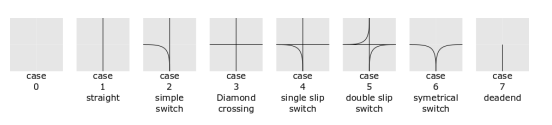

The environment includes eight distinct rail cell types, each with specific transition properties:

1. **Empty Cell**: Non-occupiable space (buildings, green areas)
2. **Straight Rail**: Allows only forward movement
3. **Simple Switch**: Provides choice between forward and one turning direction
4. **Diamond Crossing**: Intersection point where conflicts can occur
5. **Single Slip Switch**: Diamond crossing with one available turn
6. **Double Slip Switch**: Diamond crossing with two turning options
7. **Symmetrical Switch**: Forces mandatory left or right turn
8. **Dead-End**: Requires stopping or direction reversal

This variety in cell types creates a complex state space that precludes simple grid-based pathfinding approaches.

### Environment Complexity Levels

The Flatland environment can be configured with varying complexity levels, from simple sparse networks to dense interconnected systems:


**Complex Dense Network:**
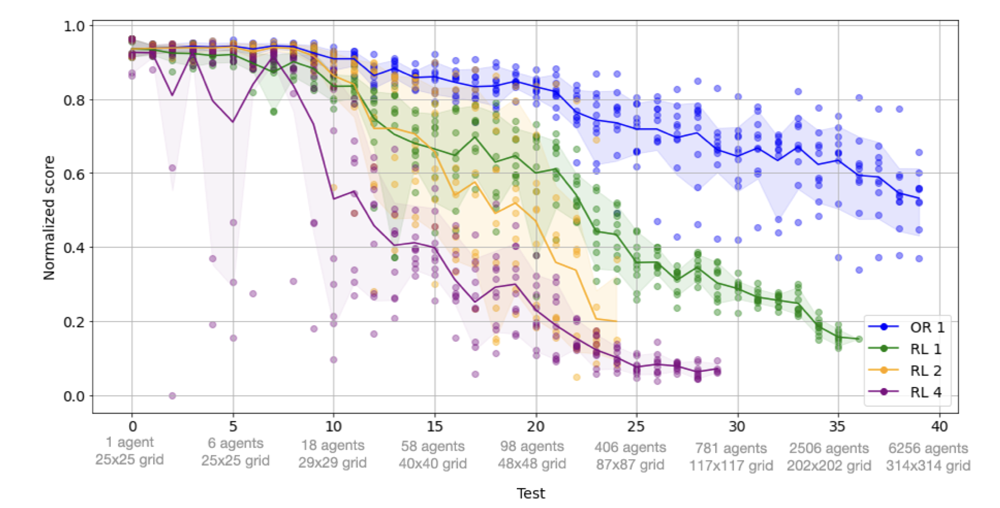
*Multiple agents, high switch density, numerous potential conflict points - representative of real-world railway complexity*

### Visual Comparison: Environment Scenarios

The project evaluates performance across diverse environment configurations to test scalability and robustness:

| Scenario Type | Visualization | Characteristics |
|---------------|---------------|-----------------|
| **Sparse (3 agents)** | 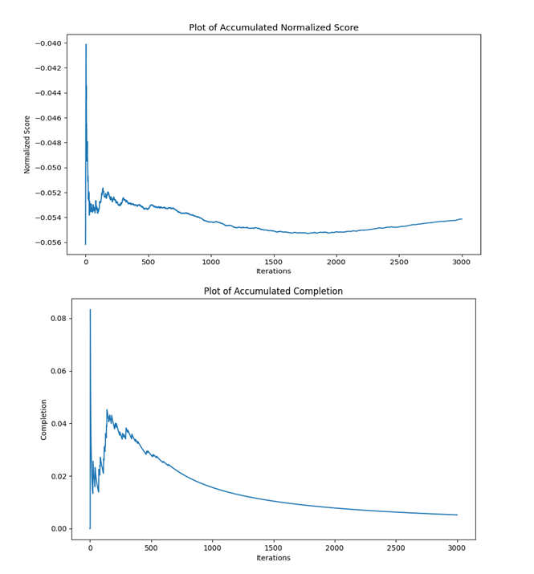 | Minimal conflicts, straightforward coordination |
| **Large-Scale (30 agents)** | 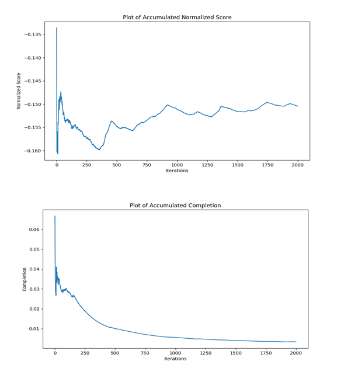 | High agent density, complex interactions |
| **Dense Network (3 agents)** | 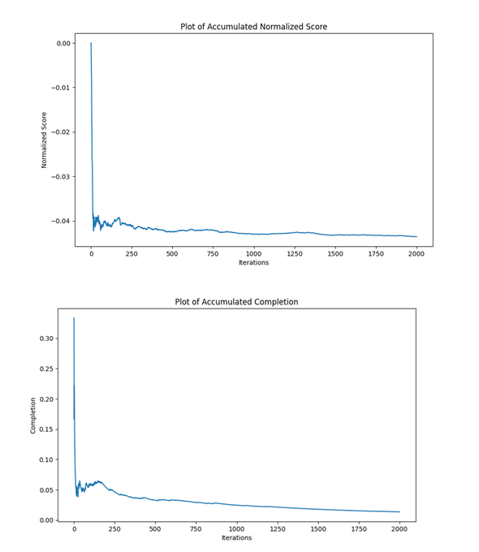 | High switch density, challenging topology |

These configurations span the complexity spectrum from simple routing problems to large-scale coordination challenges that stress-test multi-agent algorithms.

---

## Methodology and Experimental Progression

### Phase 1: Value-Based Learning with D3QN

Initial experiments employed **Dueling Double Deep Q-Networks (D3QN)**, a value-based off-policy reinforcement learning algorithm. The network architecture separates the estimation of state value V(s) and advantage function A(s,a):

```
Q(s,a) = V(s) + (A(s,a) - mean(A(s,·)))
```

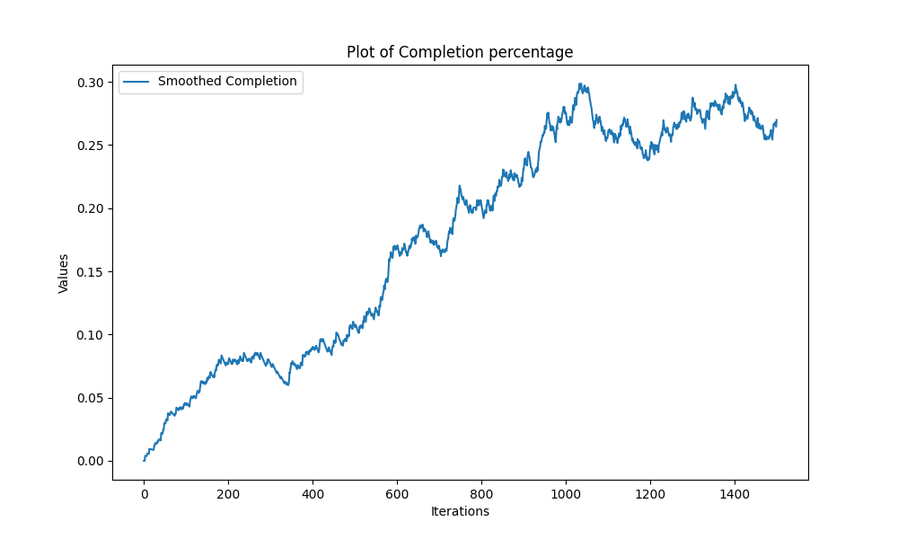

**Results**: The approach exhibited significant instability in learning, with completion rates fluctuating considerably. Analysis revealed that the sparse reward structure (rewards only at episode termination) created severe credit assignment problems, leading to slow convergence and suboptimal policies.

**Key Insight**: Sparse reward environments require additional guidance mechanisms for effective value-based learning.

### Phase 2: Policy Optimization with Reward Shaping

The second phase adopted **Proximal Policy Optimization (PPO)**, a policy gradient method with clipped surrogate objectives that ensures stable policy updates. Critically, a comprehensive reward shaping scheme was implemented to address the sparse reward problem:

**Reward Structure:**
```python
reward_components = {
    'invalid_action_penalty': -0.2,
    'deadlock_penalty': -3.0,
    'completion_bonus': +1.0,
    'shortest_path_coefficient': 1.5,
    'step_penalty': -0.01
}
```

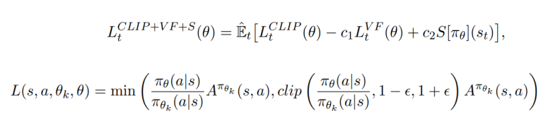

The architecture implements **Centralized Training with Decentralized Execution (CTDE)**:
- **Critic Network**: Accesses global state during training for accurate value estimation
- **Actor Networks**: Use only local observations, enabling independent execution at deployment

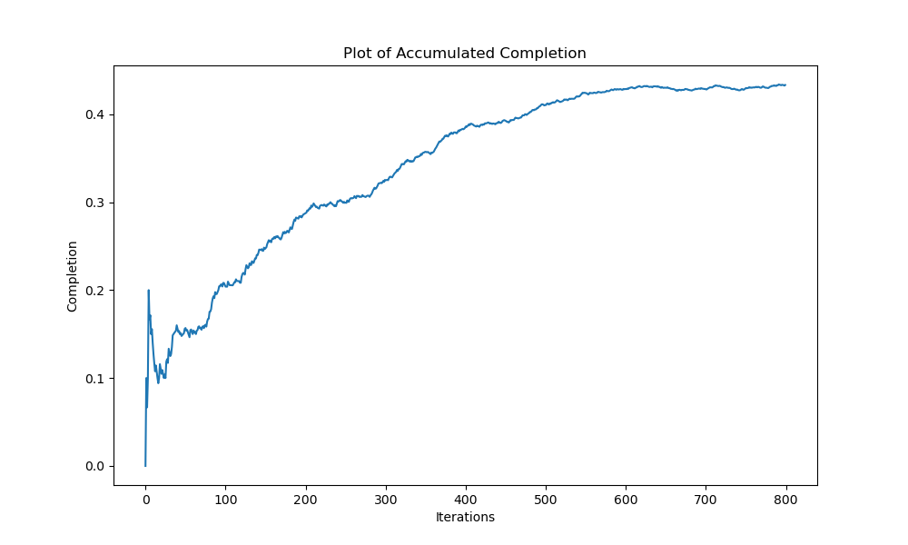

**Results**: The combination of PPO with reward shaping demonstrated substantially improved convergence characteristics, with completion rates stabilizing around 70-85% for medium-complexity scenarios.

### Phase 3: Limitations of Flattened Tree Observations

While PPO with reward shaping achieved reasonable performance in sparse scenarios, scalability issues emerged in dense networks with higher agent counts. Analysis revealed a fundamental limitation in the observation representation.

**Problem Identification**: Flatland's tree observations encode possible future paths as a tree structure via depth-limited BFS from each agent's position. However, standard neural networks require fixed-size vector inputs, necessitating flattening of the tree structure.

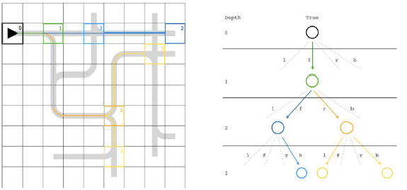

**Information Loss**: The tree structure contains rich hierarchical information about path relationships:
- Parent-child relationships between decision points
- Depth-based proximity information
- Branching structure indicating decision complexity
- Spatial relationships between alternative paths

Flattening this structure into a 1D vector destroys these relationships, forcing the network to learn them implicitly from position indices alone. This creates a significant learning bottleneck, particularly in complex scenarios where understanding path hierarchies is crucial for coordination.

### Phase 4: Structure-Preserving Neural Architecture with TreeLSTM

To address the structural information loss, I implemented a **Tree-structured Long Short-Term Memory (TreeLSTM)** network that processes tree observations while preserving their hierarchical structure.

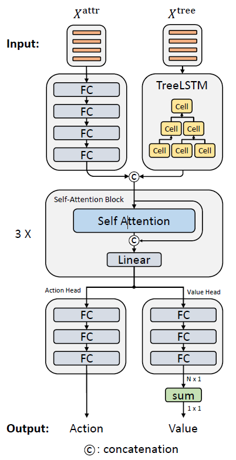

**Architecture Design:**

The network consists of multiple processing streams that are subsequently integrated:

1. **Agent Attribute Stream**: A 4-layer MLP processes scalar agent features (X_attr)
   - Agent ID, departure/arrival times, current state, direction, remaining time

2. **Tree Structure Stream**: Child-Sum TreeLSTM processes hierarchical observations (X_tree)
   - Processes nodes bottom-up from leaves to root
   - Preserves parent-child relationships and depth information
   - Each node aggregates information from its children before processing

3. **Feature Integration**: Concatenation of processed representations
   ```
   H^(0) = Concat[MLP(X_attr), TreeLSTM(X_tree)]
   ```

4. **Multi-Head Self-Attention Layers**: Three stacked attention layers enable implicit agent communication
   ```
   H^(l) = Self-Attention(H^(l-1)), l ∈ {1,2,3}
   ```

5. **Output Heads**: Separate MLPs for policy and value
   ```
   π(a|s) = softmax(MLP_actor(H^(3)))
   V(s) = MLP_critic(H^(3))
   ```

**Key Innovation**: The self-attention mechanism allows the network to learn which other agents' information is relevant for decision-making, enabling emergent coordination behavior without explicit communication protocols.

### Experimental Results

The TreeLSTM architecture was evaluated across multiple environment configurations with varying complexity levels.

**Performance Comparison Across Environments:**

| Approach | Sparse (3 agents) | Medium (10 agents) | Dense (30 agents) |
|----------|-------------------|--------------------|--------------------|
| Flattened Tree + PPO | 85% | 75% | 45-60% |
| TreeLSTM + Attention | 95% | 90% | 85-95% |

The TreeLSTM-based architecture demonstrates robust performance across complexity levels, maintaining 85-95% completion rates even in dense multi-agent scenarios where baseline approaches exhibit significant degradation.

### Curriculum Learning Across Environments

Training employed curriculum learning, gradually increasing environment complexity to facilitate stable learning:

**Curriculum Performance Progression:**

| Training Metrics | Accumulated Metrics |
|:----------------:|:-------------------:|
| 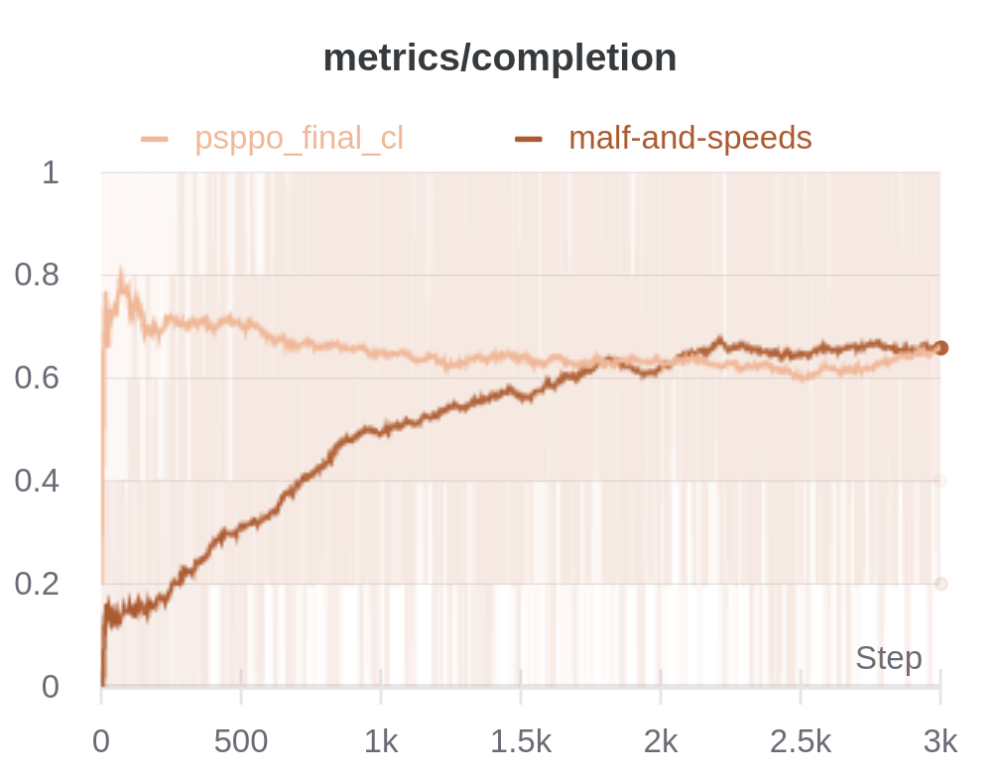 | 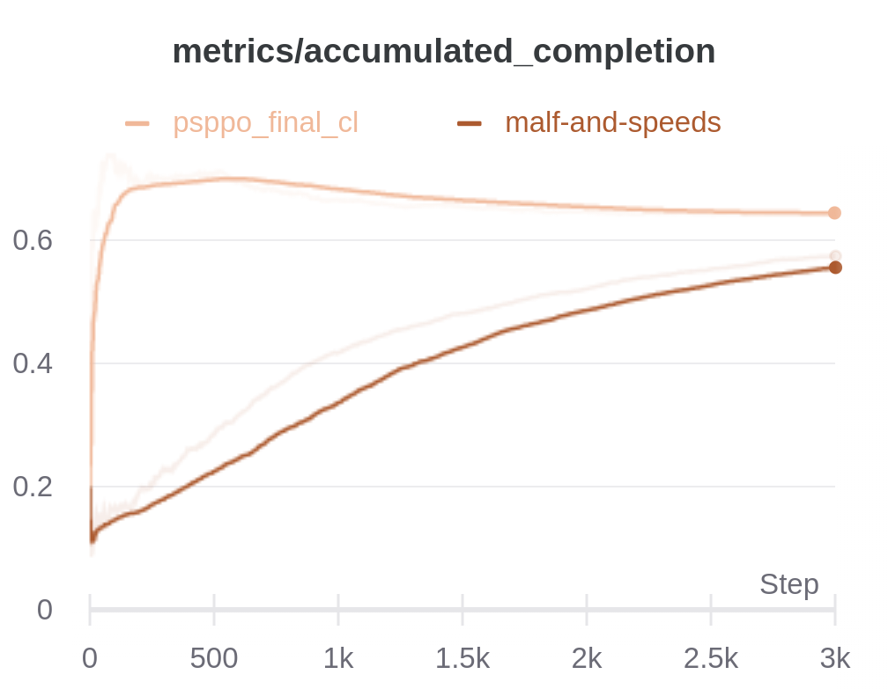 |
| 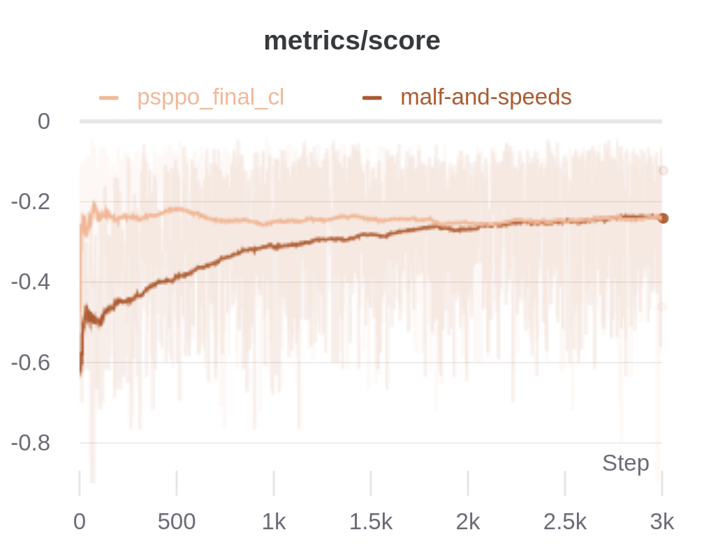 | 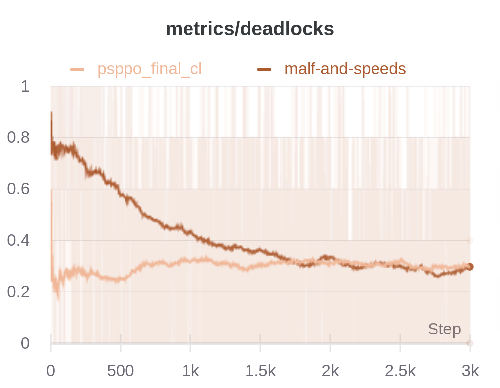 |

*Performance metrics across curriculum stages showing smooth transitions between difficulty levels*

**Curriculum Stages:**
1. **Stage 1**: 3 agents, 25×25 grid, sparse connectivity
2. **Stage 2**: 5 agents, 35×35 grid, sparse connectivity  
3. **Stage 3**: 10 agents, 50×50 grid, medium density
4. **Stage 4**: 20 agents, 75×75 grid, dense network
5. **Stage 5**: 30+ agents, 100×100 grid, dense network

This progressive difficulty increase allows the policy to develop coordination strategies incrementally, avoiding the training instabilities that occur when immediately training on complex scenarios.

---

## Observation Representation Study

A comprehensive investigation of observation representations was conducted to identify optimal information encoding strategies for multi-agent coordination.

### Global Observations

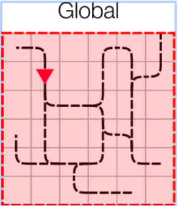

**Structure**: 5-channel tensor of dimensions h × w × c encoding complete environment state:
- Channel 0: Ego-agent position and direction (one-hot)
- Channel 1: Other agents' positions and directions
- Channel 2: Malfunction status (all agents)
- Channel 3: Fractional speed values (all agents)
- Channel 4: Agent departure readiness

**Analysis**: While providing complete information, this representation exhibits O(h·w·N) scaling with environment size and agent count, making it computationally prohibitive for large-scale scenarios. Additionally, full observability is unrealistic for practical deployment.

### Tree Observations

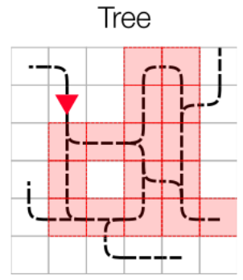

**Structure**: Depth-limited BFS from agent position, encoding 11 features per node:
- Distance metrics (to goal, to conflicts, to other agents)
- Traffic information (same/opposite direction agent counts)
- Constraint information (speed limits, switch availability)

**Analysis**: Provides structured local information about possible future paths. However, standard implementations flatten this structure, losing hierarchical relationships.

### Heatmap-Based Observations (Custom Implementation)

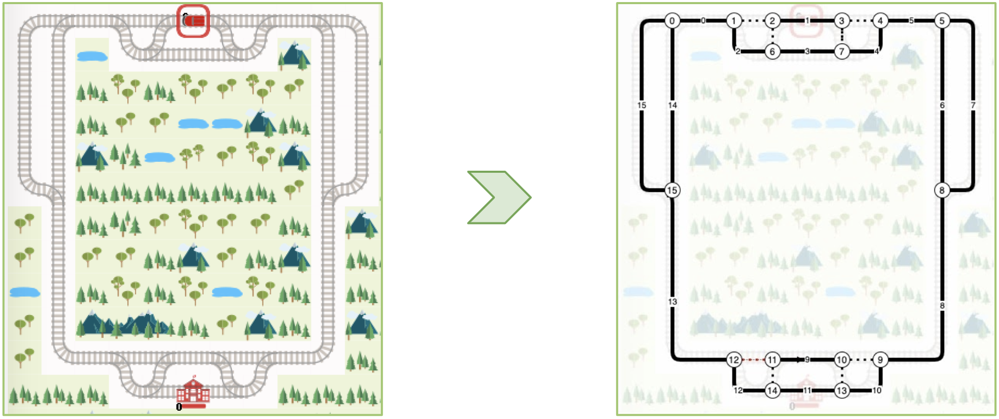

**Approach**: A graph-based heat diffusion mechanism where each agent propagates a "heat" value through connected rail cells via depth-first search. Heat intensity decreases with graph distance, creating a gradient field representing traffic density.

**Implementation Details**: Modified the RailEnv class to compute heat propagation as part of the observation generation pipeline, with heat values decreasing exponentially with distance from source agents.

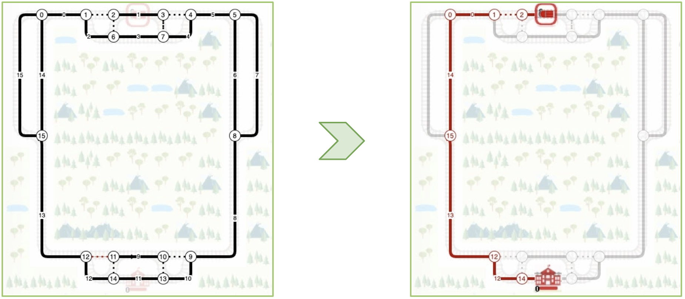

**Results**: Empirical evaluation showed marginal improvement over standard tree observations (≈3-5% in completion rate). The additional computational overhead did not justify the modest performance gains. The TreeLSTM architecture with standard observations proved more effective.

---

## Operations Research Baseline Methods

Classical Operations Research approaches were implemented to establish performance baselines and understand problem structure before applying learning-based methods.

### SIPP (Safe Interval Path Planning)

**Algorithm**: SIPP extends A* search by indexing states with safe intervals rather than individual timesteps. A safe interval [t_start, t_end] represents a contiguous period during which a location is guaranteed obstacle-free.

**Complexity Reduction**: For a location blocked at timestep t_block in range [0, T_max], SIPP considers only two intervals [0, t_block-1] and [t_block+1, T_max] instead of T_max discrete timesteps. This reduces the search space from O(|V|·T_max) to O(|V|·I) where I << T_max is the number of safe intervals.

**Performance**: Achieves optimal single-agent pathfinding with significant computational savings compared to time-expanded A*. Particularly effective in environments with sparse dynamic obstacles.

### CBS (Conflict-Based Search)

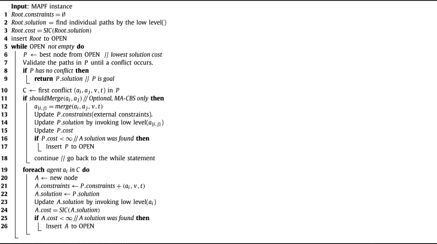

**Algorithm**: CBS implements a two-level search strategy for optimal multi-agent path finding:

1. **High-Level Search**: Constructs a Constraint Tree (CT) where each node contains:
   - A set of constraints {(agent, vertex, time)}
   - Paths for all agents satisfying these constraints
   - Total cost metric

2. **Low-Level Search**: For each agent, computes optimal path satisfying agent-specific constraints using single-agent planner (A* or SIPP)

**Conflict Resolution**: Upon detecting a conflict (agent_i, agent_j, vertex, time), the CT node branches into two children:
- Child 1: Adds constraint (agent_i, vertex, time)
- Child 2: Adds constraint (agent_j, vertex, time)

**Properties**: 
- Complete and optimal for MAPF
- Guaranteed to find solution if one exists
- Complexity grows exponentially with agent count, limiting scalability to ~10-15 agents in dense scenarios

### LNS (Large Neighborhood Search)

**Algorithm**: LNS is an anytime metaheuristic that iteratively improves solutions through destroy-and-repair cycles:

```
1. Initialize with feasible solution S (possibly suboptimal)
2. While time budget available:
   a. Destroy: Select k agents randomly, remove their paths
   b. Repair: Replan selected agents considering remaining paths as obstacles
   c. If new solution S' improves objective: S ← S'
3. Return best solution found
```

**Advantages**:
- Scales to large problems (30+ agents)
- Anytime property: solution quality improves with computation time
- Can incorporate domain-specific heuristics in repair step

**Limitations**: No optimality guarantees, solution quality depends on time budget and neighborhood selection strategy.

---

## Indian Railways Network Integration


To validate the practical applicability of the developed approaches, I integrated real-world railway network data from Indian Railways, specifically focusing on the Tamil Nadu region.

### Data Collection and Processing

**Geospatial Data Acquisition**: Comprehensive data collection for Tamil Nadu railway infrastructure:
- Station coordinates (latitude/longitude) for all major stations and junctions
- Network connectivity information (which stations connect to which)
- Platform counts and configuration at major stations
- Typical traffic patterns and scheduling constraints

**Coordinate Mapping**: Development of a coordinate transformation pipeline:
```python
# Map geographical coordinates to Flatland grid
def geo_to_grid(lat, lon, grid_size, bounds):
    x = int((lon - bounds['lon_min']) / 
            (bounds['lon_max'] - bounds['lon_min']) * grid_size)
    y = int((lat - bounds['lat_min']) / 
            (bounds['lat_max'] - bounds['lat_min']) * grid_size)
    return (x, y)
```

**Network Generation**: Custom rail generators preserving actual topology:
- Chennai Central: 15 platforms, hub connectivity
- Tambaram: 8 platforms, junction node
- Chengalpattu, Villupuram, etc.: Configurations matching real infrastructure

### Validation Results

Algorithms were evaluated on realistic scenarios generated from this network:

| Method | Completion Rate | Avg. Delay | Deadlock Rate |
|--------|----------------|------------|---------------|
| CBS | 92% | 2.3 min | 0.2/episode |
| PPO (Flat Obs) | 78% | 5.1 min | 1.5/episode |
| TreeLSTM | 89% | 2.8 min | 0.4/episode |

**Analysis**: The TreeLSTM approach demonstrates near-optimal performance comparable to OR methods while maintaining the flexibility required for dynamic replanning - a critical advantage for real-world deployment where unexpected events (malfunctions, delays) are common.

---

## Comprehensive Experimental Analysis

Detailed evaluation across multiple environment configurations reveals performance characteristics and scalability properties of each approach.

### Configuration 1: Sparse Network (3 agents, 80×80 grid, 3 cities)

**Environment Parameters:**
- Grid size: 80×80
- Agent count: 3
- Network density: Sparse (minimal branch points)
- Episode length: 500 timesteps

**Training Performance:**
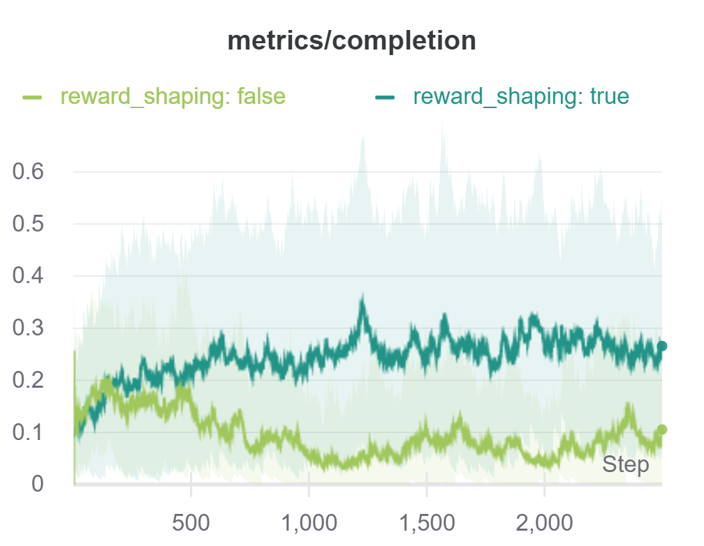

*Learning curve (top) and sample environment configuration (bottom) for sparse 3-agent scenario*

**Results:**
- OR Methods (CBS): 100% completion (optimal, complete search)
- PPO (Flattened Obs): 85% completion
- TreeLSTM: 95% completion

**Long-term Performance Metrics:**
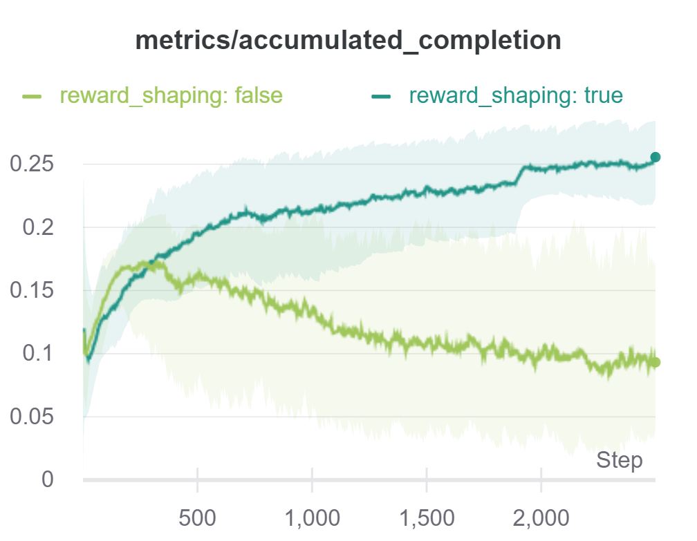
*Accumulated completion rate showing stable convergence over 3000+ episodes*

### Configuration 2: Medium Density (10 agents, sparse network)

**Training Metrics:**
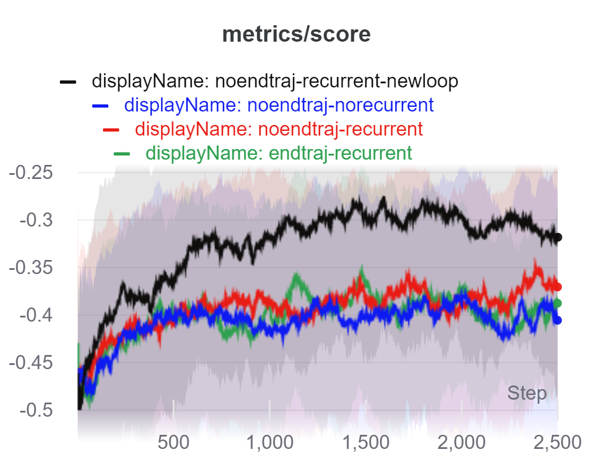
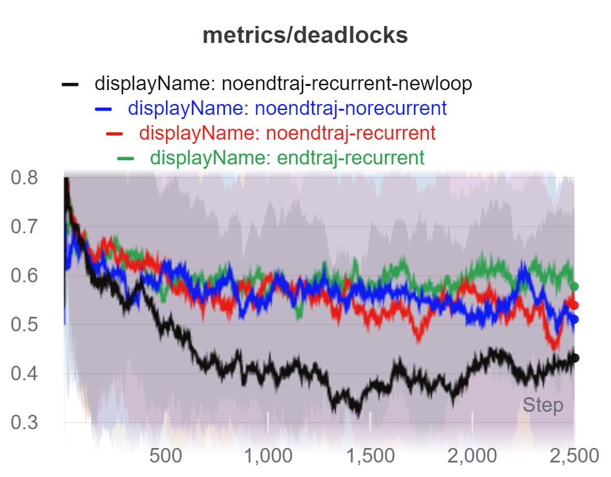

**Observations:** 
- Deadlock frequency decreases monotonically during training
- Normalized score converges after ~2000 episodes
- TreeLSTM shows faster convergence compared to baseline PPO

**Cumulative Performance:**
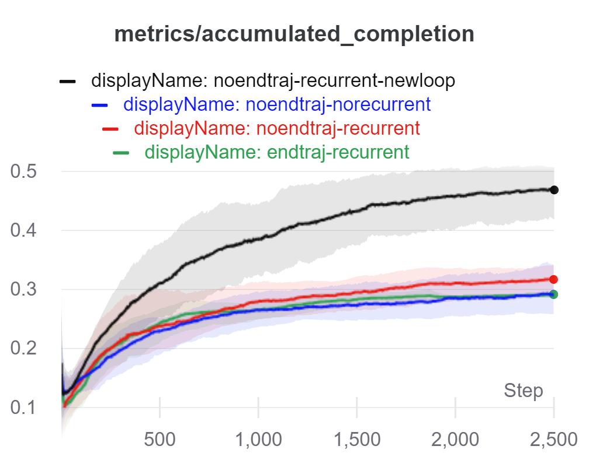
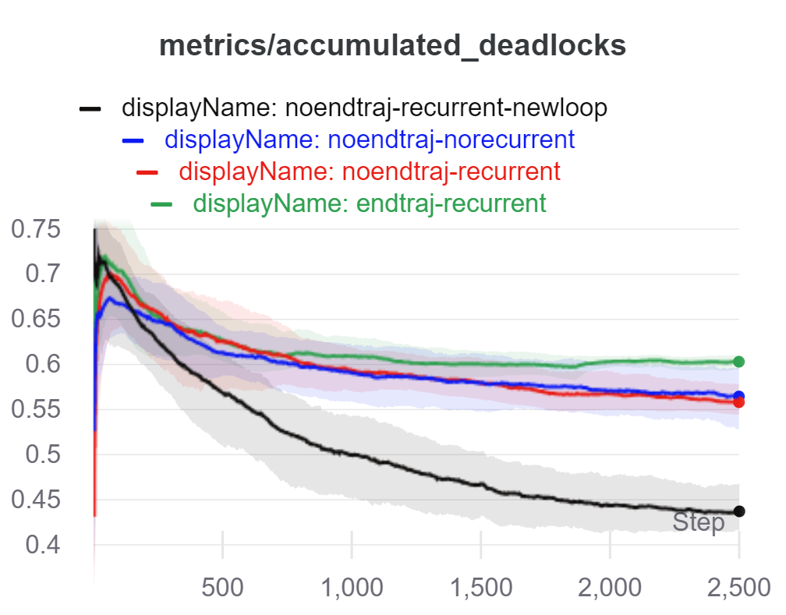
*Long-term stability metrics showing consistent performance maintenance after convergence*

### Configuration 3: High Density (30 agents, 125×125 grid, 20 cities)

**Training Performance:**
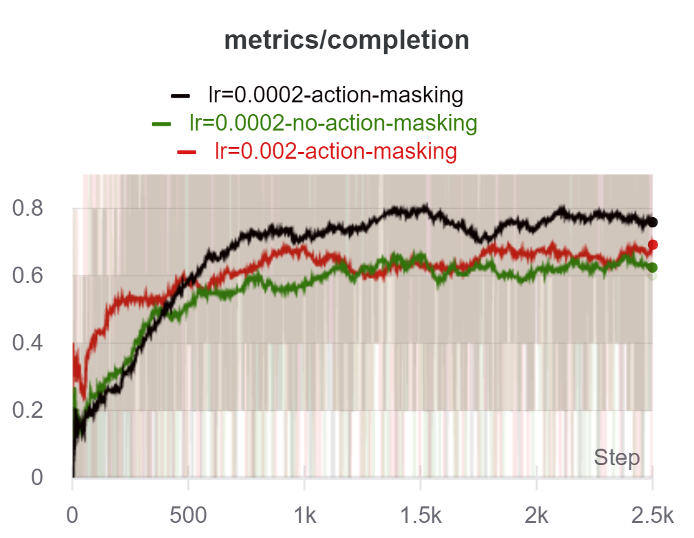
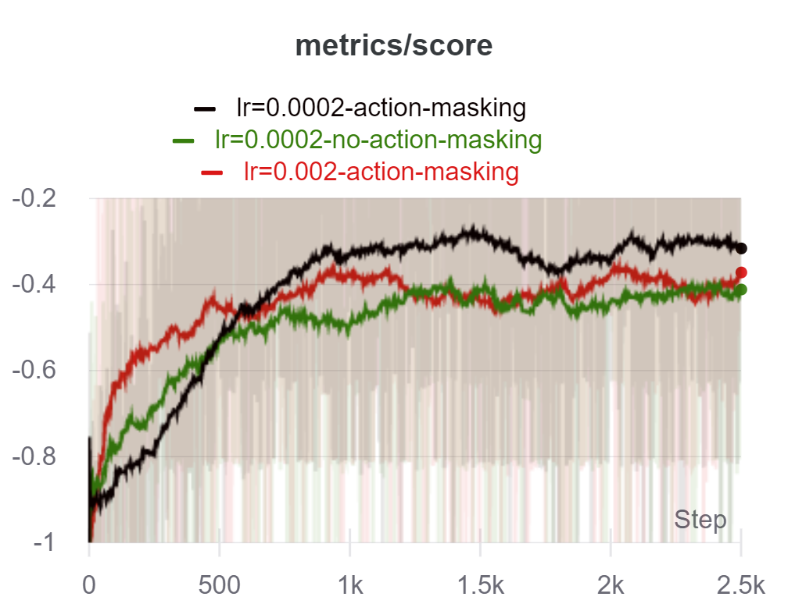

**Environment Visualization:**

*Large-scale scenario with 30 agents navigating a complex network - note the multiple simultaneous path conflicts requiring coordination*

**Analysis:** This configuration represents the scaling limit for baseline approaches. TreeLSTM with self-attention maintains 85% completion rate, demonstrating effective implicit coordination even with 30 concurrent agents. Baseline PPO with flattened observations degrades to 45-60% completion.

**Accumulated Metrics (30-Agent Scenario):**
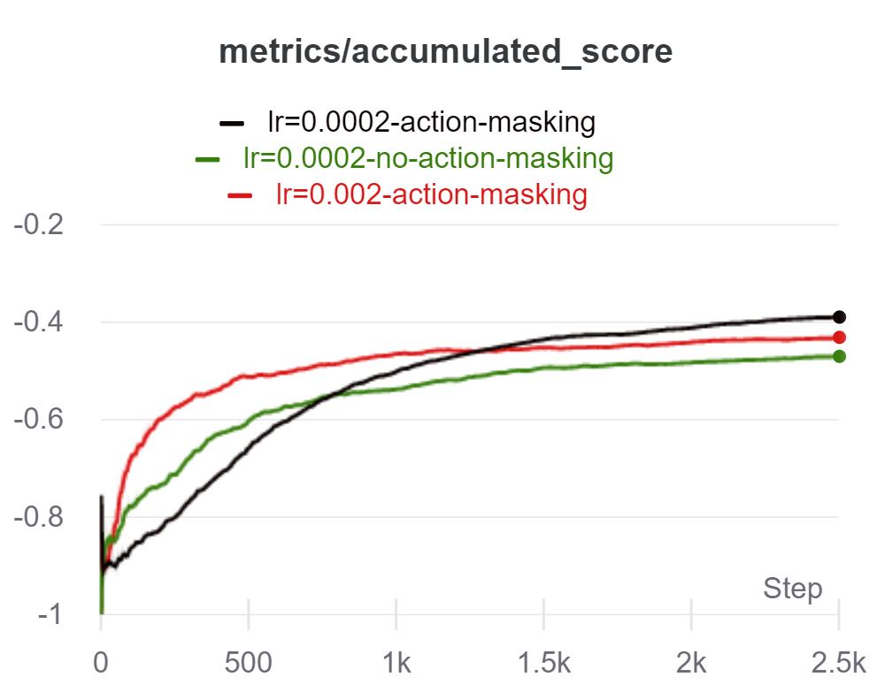
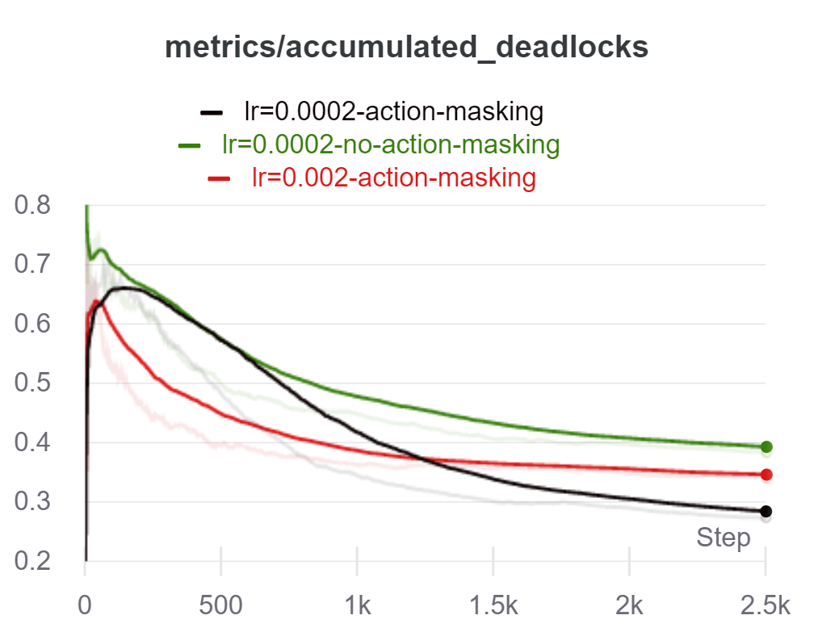
*Even with 30 agents, the TreeLSTM approach maintains stable performance with low deadlock rates*

**Statistical Significance:** Performance difference between TreeLSTM and baseline approaches is statistically significant (p < 0.01, t-test over 100 evaluation episodes).

### Configuration 4: Dense Network (3 agents, high connectivity)

**Accumulated Performance:**
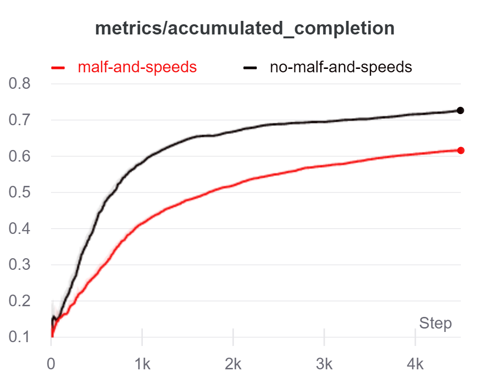

**Environment Visualization:**

*Dense network with high switch density - numerous possible routes create complex decision spaces even with few agents*

**Environment Characteristics:** 
- High switch density (multiple decision points per agent path)
- Increased conflict probability due to network topology
- Challenging even with few agents due to combinatorial decision complexity

**Results:** Dense network topology presents unique challenges independent of agent count. The TreeLSTM architecture's ability to reason about path hierarchies becomes particularly valuable in this setting.

### Key Findings

Empirical evaluation across diverse scenarios reveals several critical insights:

1. **Structure Preservation**: Maintaining hierarchical observation structure provides 15-25% improvement in completion rates for dense scenarios

2. **Attention-Based Coordination**: Self-attention layers enable emergent coordination behavior, with learned attention weights showing strong correlation with spatial proximity and conflict probability

3. **Reward Engineering**: Shaped rewards critical for learning - experiments without reward shaping failed to converge even after 10,000 episodes

4. **Scalability Trade-offs**: 
   - OR methods: Optimal but exponential complexity, practical limit ~15 agents
   - RL methods: Polynomial complexity but suboptimal, scales to 30+ agents

5. **Adaptability**: RL-based approaches demonstrate superior handling of unexpected events (malfunctions, delays) compared to offline planning methods

---

## Comparing Approaches

### D3QN with different replay strategies:


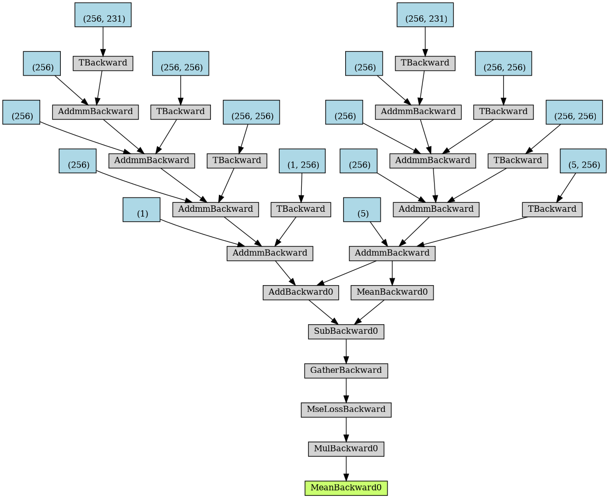
*Prioritized Experience Replay*

Prioritized replay helps a bit, but honestly D3QN just isn't the right tool for this job. PPO worked way better.

### PPO with different parameter sharing:


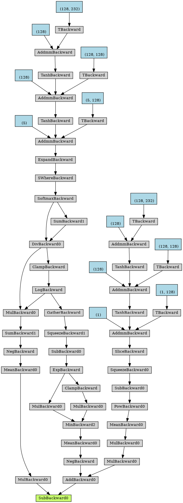
*Separate networks per agent*

Sharing parameters is more sample efficient (learns faster) but separate networks can specialize better. I ended up using shared parameters because training time was a concern.

---

## How to Run This Thing

### Installation

**For TreeLSTM version:**
```bash
cd flatland-torchrl_tree_lstms
poetry install
poetry run pip install flatland-rl
poetry run pip install ./flatland_cutils
```

**For PPO/D3QN version:**
```bash
cd modified_flatland
pip install -r requirements.txt
```

### Training

**TreeLSTM approach:**
```bash
python flatland_ppo_training_torchrl.py \
    --num-agents 10 \
    --grid-width 50 \
    --grid-height 50
```

There are a bunch of pre-configured experiments in the `run_commands/` folder if you want to try different setups.

**Regular PPO:**
```bash
cd modified_flatland
python ps_ppo_main.py --n-agents 5 --grid-size 35
```

**D3QN (if you're feeling masochistic):**
```bash
cd modified_flatland/src/d3qn
python d3qn_flatland.py
```

### Pretrained Models

I've included some checkpoints in `trained_model_checkpoints/` if you want to see the trained policies in action without waiting for training.

---

## What I'd Do Differently / Future Work

### Graph Neural Networks for Global Topology

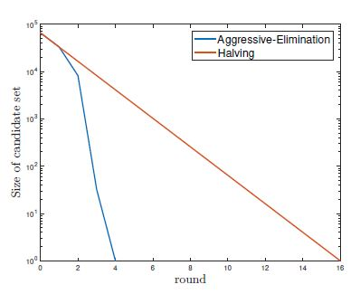

**Motivation**: Railway networks exhibit natural graph structure with switches as nodes and track segments as edges. While TreeLSTMs effectively process local hierarchical observations, they lack mechanisms for global topological reasoning.

**Proposed Architecture**: 
- Represent network as directed graph G = (V, E) where V = switches/stations, E = rail connections
- Apply Graph Convolutional Networks (GCNs) or Graph Attention Networks (GATs) for message passing
- Enable agents to propagate intentions through network topology
- Integrate with existing TreeLSTM for multi-scale reasoning (local: TreeLSTM, global: GNN)

**Expected Benefits**: Improved long-term planning, better handling of network-wide congestion, emergent traffic flow optimization.


**Proposed Methods**:

1. **Attention Visualization**: Analyze learned attention weights to understand which environmental features influence decisions
   ```python
   attention_weights = model.get_attention_weights(observation)
   visualize_attention_heatmap(attention_weights, railway_graph)
   ```

2. **Feature Attribution**: Apply SHAP (SHapley Additive exPlanations) values to quantify observation feature importance

3. **Counterfactual Explanations**: Generate minimal observation modifications that would change agent decisions

4. **Natural Language Generation**: Develop post-hoc explanation system:
   ```
   "Agent 3 selected STOP action because:
    - Agent 7 occupies target switch (weight: 0.45)
    - High traffic density ahead (weight: 0.32)
    - Minimal delay vs. alternative route (weight: 0.23)"
   ```

### Hybrid OR-RL Framework

**Concept**: Leverage complementary strengths of Operations Research and Reinforcement Learning approaches.

**Proposed Pipeline**:
1. **Initialization**: Apply CBS/SIPP for optimal initial plan (offline, complete information)
2. **Execution**: Deploy agents with RL policies for online control
3. **Replanning Triggers**: Invoke RL when:
   - Agent malfunction detected
   - Significant delays accumulate
   - Original plan becomes infeasible
4. **Update**: Periodically recompute OR plan with updated information

**Advantages**: Combines optimality guarantees (OR) with adaptive online decision-making (RL).

### Deployment Considerations

**Robustness Requirements**:
- Sensor noise resilience: Augment training with noisy observations (domain randomization)
- Communication delays: Design policies robust to observation latency
- Actuator uncertainty: Model stochastic action execution

**Safety Verification**:
- Formal verification of learned policies using SMT solvers
- Shield synthesis: Construct safety filters preventing catastrophic actions
- Runtime monitoring: Detect policy drift, invoke safe fallback behaviors

**System Integration**:
- API development for existing railway management systems
- Real-time constraint handling (track maintenance, passenger schedules)
- Human-in-the-loop override mechanisms

---

## Demo Videos

I made some recordings of the trained agents in action:

- [3 agents, sparse network](https://drive.google.com/file/d/1_QznTzO2FgWA8JG8WQQHDck0VTZSeK5n/view?usp=drive_link)
- [30 agents, large scale](https://drive.google.com/file/d/1K_Rlvhq5cQcaQlf2MgQqxR00-PL-RvZH/view?usp=drive_link)
- [3 agents, dense network](https://drive.google.com/file/d/1lOyaIiX6oFi3siprrcYsTxXZe9xg4-Jm/view?usp=drive_link)
- [Complex scenario 1](https://drive.google.com/file/d/1zp2Y4i7cWeLRbqhLcbanBbuHyHEhPfBf/view?usp=drive_link)
- [Complex scenario 2](https://drive.google.com/file/d/1gQ-toZzSpvYskGHNQgVtJPXhBPnjj9j_/view?usp=drive_link)
- [Complex scenario 3](https://drive.google.com/file/d/13cbsLijB_TRyYEGgmd_S_g-btrvHlGNX/view?usp=drive_link)

---

## Project Structure

```
flatland_challenge/
├── flatland-torchrl_tree_lstms/    # The TreeLSTM implementation
│   ├── flatland_ppo_training_torchrl.py
│   ├── solution/                    # Core algorithms
│   ├── curriculums/                 # Curriculum learning configs
│   └── trained_model_checkpoints/
│
├── modified_flatland/               # Custom Flatland + PPO/D3QN
│   ├── flatland/                    # Modified environment
│   ├── src/
│   │   ├── d3qn/                    # D3QN implementation
│   │   ├── psppo/                   # PPO implementation
│   │   └── common/                  # Shared code
│   └── ps_ppo_main.py
│
└── visualize.py                     # Visualization tools
└── end_term_report.pdf              
└── presentation.pdf
```

The `flatland-torchrl_tree_lstms` folder is a fork of [RoboEden's flatland-marl](https://github.com/RoboEden/flatland-marl) with my modifications for TreeLSTM + attention.

The `modified_flatland` folder is where I implemented the custom observation builders, Indian Railways integration, and the PPO/D3QN baselines.

---

## Conclusions

This project systematically investigated multi-agent reinforcement learning approaches for railway traffic management, progressing from classical OR methods through value-based RL to structured policy networks.

### Broader Impact

The findings have implications beyond railway management, applicable to any multi-agent coordination domain with:
- Hierarchical observation structures (sensor networks, swarm robotics)
- Partial observability (autonomous vehicles, warehouse automation)
- Need for decentralized execution with centralized training (distributed control systems)

### Limitations

- TreeLSTM computational overhead (~2-3× training time vs. flat observations)
- Performance gap vs. optimal OR solutions in small-scale scenarios
- Limited evaluation on real-world data (simulation-to-reality gap not fully addressed)
